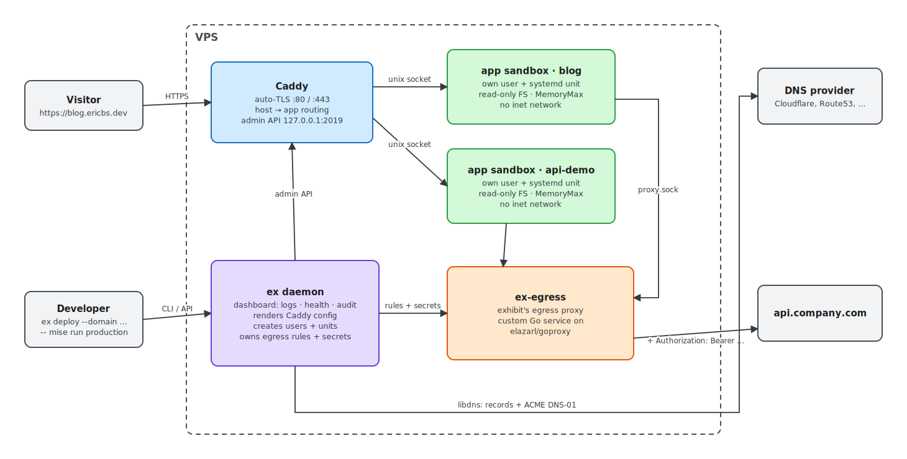
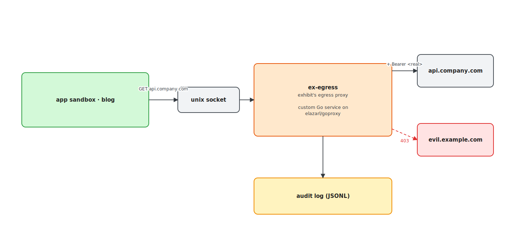

# exhibit.ericbs.dev

Publish webapps instantly with ease. Intended for use on a single VPS.

1. Enter a webapp project (html/react/vue/svelte)
2. `ex deploy --domain project.ericbs.dev --allow-net api.company.com -- mise run production`
3. `curl https://project.ericbs.dev` - 200 OK

Exhibit comes with a dashboard to:
- view health & terminal logs
- proxy requests & attach auth from outside the webapp sandboxes
- monitor traffic & audit every outbound request
- see which sandbox protections are active per app

## What's different compared to vercel, coolify etc.?

It's:
- open source & forever free
- slimmed down to hobbyist use needs
- extremely easy to setup and self host
- container-free: apps run as sandboxed processes, so it works on any VPS
- built to proxy secrets & audit outgoing authorised requests
- focused on security & observability out-of-the-box (see architecture)

No existing self-hosted tool combines these - see [RESEARCH.md](RESEARCH.md).

## Architecture

One `ex` daemon orchestrates three things: Caddy for ingress, an egress proxy for outbound traffic, one sandbox per app.



- **Ingress**: Caddy terminates TLS and routes by hostname to each app's unix socket. `ex` pushes routes through Caddy's admin API - no restarts, zero-downtime redeploys. Certs are issued on demand; Caddy asks `ex` whether a domain is deployed before issuing.
- **Sandbox**: each app gets its own linux user and a hardened systemd unit (read-only FS, memory/CPU limits, loopback-only network). Landlock rules are added where the kernel supports them; bwrap is the fallback without systemd. Detected per deploy, shown in the dashboard. No containers or virtualization needed - runs on any KVM VPS (Hetzner etc.).
- **Egress**: deny-by-default. Apps have no direct network; the only way out is exhibit's proxy over a unix socket. The proxy enforces the allowlist, blocks private IPs (SSRF), injects secrets and logs every request.

### Secrets

Apps never hold secrets. The app sees a placeholder; the egress proxy swaps it for the real credential only on requests to the host you bound it to.

```
in the app's env:   API_KEY=exhibit:placeholder
app calls:          GET api.company.com
ex-egress sends:    GET api.company.com   Authorization: Bearer <real key>
```

A compromised app can leak nothing, and every call it makes is on record.



This can be used to, for example:
- Allow only GET requests to `*.super-sensitive-environment.company.com`
- Attach `Bearer ...` token on all requests to `api.company.com`. This separates credentials from potentially weak/unsecured/untrusted webapps.

Build plan in [PLAN.md](PLAN.md).

## DNS adaptors

Exhibit uses a single interface for DNS management: [libdns](https://github.com/libdns/libdns) - the same provider packages that power Caddy's DNS plugins (~100 providers). One set of credentials drives record creation and ACME DNS-01.

## Rationale & decisions

#### Why proxy requests through exhibit?

Egress is deny-by-default: a deployed app can only reach hosts you allow with `--allow-net`. This is what makes the rest possible - monitoring traffic, whitelisting networks, disallowing requests dynamically, and keeping secrets out of the apps entirely. Prior art converged on the same default (zerobox, Gondolin, Cloudflare sandboxes); see [RESEARCH.md](RESEARCH.md) for why.
